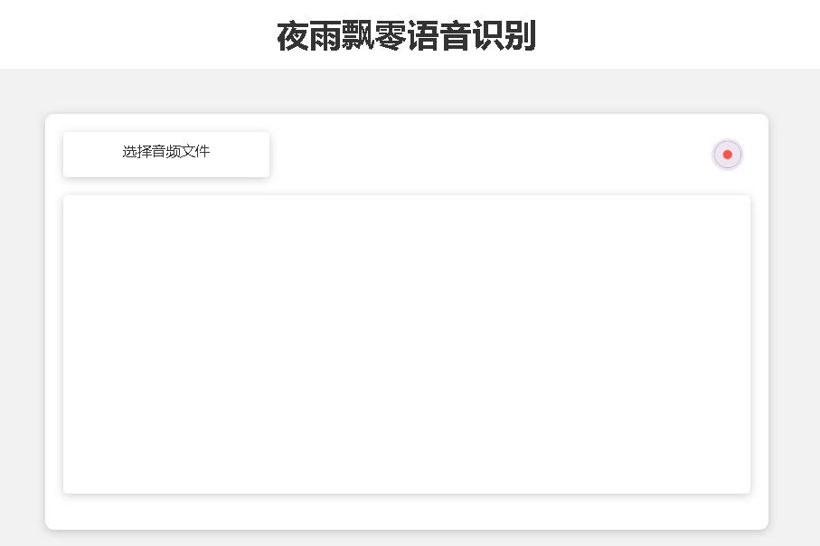
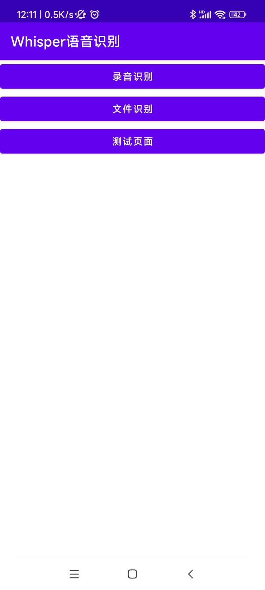
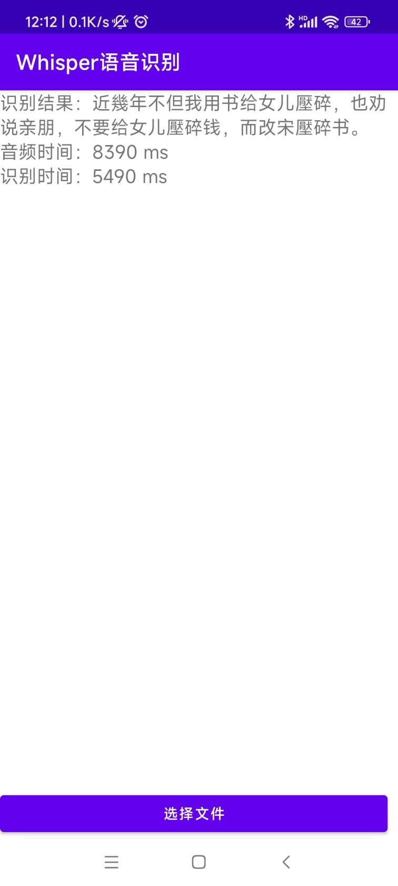
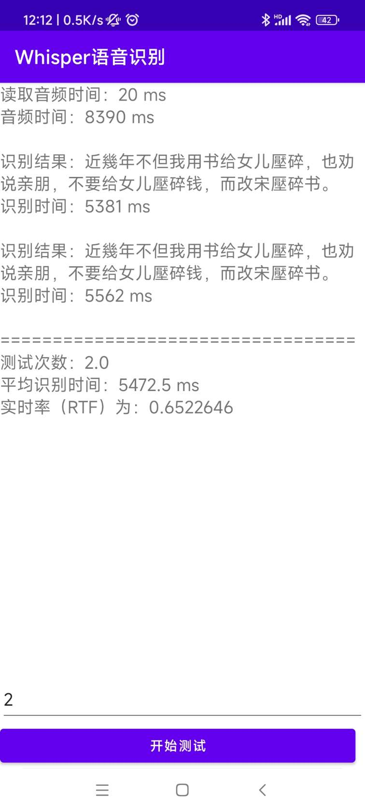
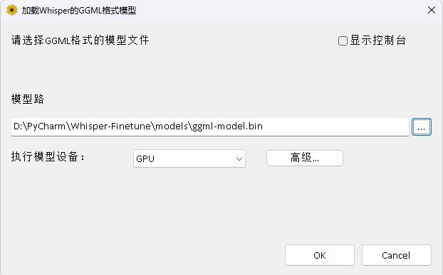

# 微调Whisper语音识别模型和加速推理

简体中文 | [English](./README_en.md)


## 前言

OpenAI在开源了号称其英文语音辨识能力已达到人类水准的Whisper项目，且它亦支持其它98种语言的自动语音辨识。Whisper所提供的自动语音识与翻译任务，它们能将各种语言的语音变成文本，也能将这些文本翻译成英文。本项目主要的目的是为了对Whisper模型使用Lora进行微调，**支持无时间戳数据训练，有时间戳数据训练、无语音数据训练**。目前开源了好几个模型，具体可以在[openai](https://huggingface.co/openai)查看，下面列出了常用的几个模型。另外项目最后还支持CTranslate2加速推理和GGML加速推理，提示一下，加速推理支持直接使用Whisper原模型转换，并不一定需要微调。支持Windows桌面应用，Android应用和服务器部署。

### 请先点 :star: 

## 支持模型

 - openai/whisper-tiny
 - openai/whisper-base
 - openai/whisper-small
 - openai/whisper-medium
 - openai/whisper-large
 - openai/whisper-large-v2
 - openai/whisper-large-v3

**欢迎大家扫码入知识星球（左）或者QQ群（右）讨论，知识星球里面提供项目的模型文件和博主其他相关项目的模型文件，也包括其他一些资源。**

<div align="center">
  
  
</div>


**使用环境：**

- Anaconda 3
- Python 3.8
- Pytorch 1.13.1
- Ubuntu 18.04
- GPU A100-PCIE-40GB*1


### 视频讲解：[哔哩哔哩](https://www.bilibili.com/video/BV1S8411o7rm/)

### 演示地址：[Web部署](https://whisper.yeyupiaoling.cn:8082/)

## 目录
 - [项目主要程序介绍](#项目主要程序介绍)
 - [模型测试表](#模型测试表)
 - [安装环境](#安装环境)
 - [准备数据](#准备数据)
 - [微调模型](#微调模型)
   - [单卡训练](#单卡训练)
   - [多卡训练](#多卡训练)
 - [合并模型](#合并模型)
 - [评估模型](#评估模型)
 - [预测](#预测)
 - [GUI界面预测](#GUI界面预测)
- [Web部署](#Web部署)
    - [接口文档](#接口文档)
- [使用Ctranslate2格式模型预测](#使用Ctranslate2格式模型预测)
- [Android部署](#Android部署)
 - [Windows桌面应用](#Windows桌面应用)
 - [打赏作者](#打赏作者)

<a name='项目主要程序介绍'></a>

## 项目主要程序介绍

1. `aishell.py`：制作AIShell训练数据。
2. `finetune.py`：微调模型。
3. `merge_lora.py`：合并Whisper和Lora的模型。
4. `evaluation.py`：评估使用微调后的模型或者Whisper原模型。
5. `infer.py`：使用调用微调后的模型或者transformers上的Whisper模型预测。
6. `infer_ct2.py`：使用转换为CTranslate2的模型预测，主要参考这个程序用法。
7. `infer_gui.py`：有GUI界面操作，使用调用微调后的模型或者transformers上的Whisper模型预测。
8. `infer_server.py`：使用调用微调后的模型或者transformers上的Whisper模型部署到服务器端，提供给客户端调用。
9. `convert-ggml.py`：转换模型为GGML格式模型，给Android应用或者Windows应用使用。
10. `AndroidDemo`：该目录存放的是部署模型到Android的源码。
11. `WhisperDesktop`：该目录存放的是Windows桌面应用的程序。


<a name='模型测试表'></a>

## 模型测试表

1. 原始模型字错率测试表。

|       使用模型       |  指定语言   | aishell_test | test_net | test_meeting |  粤语测试集  |   模型获取   | 
|:----------------:|:-------:|:------------:|:--------:|:------------:|:-------:|:--------:|
|   whisper-tiny   | Chinese |   0.31898    | 0.40482  |   0.75332    |   N/A   | 加入知识星球获取 |
|   whisper-base   | Chinese |   0.22196    | 0.30404  |   0.50378    |   N/A   | 加入知识星球获取 |
|  whisper-small   | Chinese |   0.13897    | 0.18417  |   0.31154    |   N/A   | 加入知识星球获取 |
|  whisper-medium  | Chinese |   0.09538    | 0.13591  |   0.26669    |   N/A   | 加入知识星球获取 |
|  whisper-large   | Chinese |   0.08969    | 0.12933  |   0.23439    |   N/A   | 加入知识星球获取 |
| whisper-large-v2 | Chinese |   0.08817    | 0.12332  |   0.26547    |   N/A   | 加入知识星球获取 |
| whisper-large-v3 | Chinese |   0.08086    | 0.11452  |   0.19878    | 0.18782 | 加入知识星球获取 |


2. 微调数据集后字错率测试表。

|       使用模型       |   指定语言    |                            数据集                             | aishell_test | test_net | test_meeting |  粤语测试集  |   模型获取   |  
|:----------------:|:---------:|:----------------------------------------------------------:|:------------:|:--------:|:------------:|:-------:|:--------:|
|   whisper-tiny   |  Chinese  | [AIShell](https://openslr.magicdatatech.com/resources/33/) |   0.13043    |  0.4463  |   0.57728    |   N/A   | 加入知识星球获取 |
|   whisper-base   |  Chinese  | [AIShell](https://openslr.magicdatatech.com/resources/33/) |   0.08999    | 0.33089  |   0.40713    |   N/A   | 加入知识星球获取 |
|  whisper-small   |  Chinese  | [AIShell](https://openslr.magicdatatech.com/resources/33/) |   0.05452    | 0.19831  |   0.24229    |   N/A   | 加入知识星球获取 |
|  whisper-medium  |  Chinese  | [AIShell](https://openslr.magicdatatech.com/resources/33/) |   0.03681    | 0.13073  |   0.16939    |   N/A   | 加入知识星球获取 |
| whisper-large-v2 |  Chinese  | [AIShell](https://openslr.magicdatatech.com/resources/33/) |   0.03139    | 0.12201  |   0.15776    |   N/A   | 加入知识星球获取 |
| whisper-large-v3 |  Chinese  | [AIShell](https://openslr.magicdatatech.com/resources/33/) |   0.03660    | 0.09835  |   0.13706    | 0.20060 | 加入知识星球获取 |
| whisper-large-v3 | Cantonese |                           粤语数据集                            |   0.06857    | 0.11369  |   0.17452    | 0.03524 | 加入知识星球获取 |
|   whisper-tiny   |  Chinese  |     [WenetSpeech](./tools/create_wenetspeech_data.py)      |   0.17711    | 0.24783  |   0.39226    |   N/A   | 加入知识星球获取 |
|   whisper-base   |  Chinese  |     [WenetSpeech](./tools/create_wenetspeech_data.py)      |   0.14548    | 0.17747  |   0.30590    |   N/A   | 加入知识星球获取 |
|  whisper-small   |  Chinese  |     [WenetSpeech](./tools/create_wenetspeech_data.py)      |   0.08484    | 0.11801  |   0.23471    |   N/A   | 加入知识星球获取 |
|  whisper-medium  |  Chinese  |     [WenetSpeech](./tools/create_wenetspeech_data.py)      |   0.05861    | 0.08794  |   0.19486    |   N/A   | 加入知识星球获取 |
| whisper-large-v2 |  Chinese  |     [WenetSpeech](./tools/create_wenetspeech_data.py)      |   0.05443    | 0.08367  |   0.19087    |   N/A   | 加入知识星球获取 |
| whisper-large-v3 |  Chinese  |     [WenetSpeech](./tools/create_wenetspeech_data.py)      |              |          |              |         | 加入知识星球获取 |

3. 推理速度测试表，使用GPU为GTX3090（24G），音频为`test_long.wav`，时长为3分钟整，测试程序在`tools/run_compute.sh`。

|                                   加速方式                                    |  tiny  |  base  | small  | medium  | large-v2 | large-v3 |
|:-------------------------------------------------------------------------:|:------:|:------:|:------:|:-------:|:--------:|:--------:|
|                  Transformers (`fp16` + `batch_size=16`)                  | 1.458s | 1.671s | 2.331s | 11.071s |  4.779s  | 12.826s  |    
|            Transformers (`fp16` + `batch_size=16` + `Compile`)            | 1.477s | 1.675s | 2.357s | 11.003s |  4.799s  | 12.643s  |    
|       Transformers (`fp16` + `batch_size=16` + `BetterTransformer`)       | 1.461s | 1.676s | 2.301s | 11.062s |  4.608s  | 12.505s  |    
|       Transformers (`fp16` + `batch_size=16` + `Flash Attention 2`)       | 1.436s | 1.630s | 2.258s | 10.533s |  4.344s  | 11.651s  |    
| Transformers (`fp16` + `batch_size=16` + `Compile` + `BetterTransformer`) | 1.442s | 1.686s | 2.277s | 11.000s |  4.543s  | 12.592s  |    
| Transformers (`fp16` + `batch_size=16` + `Compile` + `Flash Attention 2`) | 1.409s | 1.643s | 2.220s | 10.390s |  4.377s  | 11.703s  |    
|                 Faster Whisper (`fp16` + `beam_size=1` )                  | 2.179s | 1.492s | 2.327s | 3.752s  |  5.677s  | 31.541s  |    
|                 Faster Whisper (`8-bit` + `beam_size=1` )                 | 2.609s | 1.728s | 2.744s | 4.688s  |  6.571s  | 29.307s  |    

4. 经过处理的数据列表。

|  数据列表处理方式  | AiShell  | WenetSpeech | 
|:----------:|:--------:|:-----------:|
|   添加标点符号   | 加入知识星球获取 |  加入知识星球获取   |
| 添加标点符号和时间戳 | 加入知识星球获取 |  加入知识星球获取   |

**重要说明：**
1. 在评估的时候移除模型输出的标点符号，并把繁体中文转成简体中文。
2. `aishell_test`为AIShell的测试集，`test_net`和`test_meeting`为WenetSpeech的测试集。
3. 测试速度的音频为`dataset/test_long.wav`，时长为3分钟整。
4. 训练数据使用的是带标点符号的数据，字错率高一点。
5. 微调AiShell数据不带时间戳，微调WenetSpeech带时间戳。

<a name='安装环境'></a>

## 安装环境

- 首先安装的是Pytorch的GPU版本，以下介绍两种安装Pytorch的方式，只需要选择一种即可。

1. 以下是使用Anaconda安装Pytorch环境，如果已经安装过了，请跳过。
```shell
conda install pytorch==2.1.0 torchvision==0.16.0 torchaudio==2.1.0 pytorch-cuda=11.8 -c pytorch -c nvidia
```

2. 以下是使用Docker镜像，拉取一个Pytorch环境的镜像。
```shell
sudo docker pull pytorch/pytorch:2.1.0-cuda11.8-cudnn8-devel
```

然后进入到镜像中，同时将当前路径挂载到容器的`/workspace`目录下。
```shell
sudo nvidia-docker run --name pytorch -it -v $PWD:/workspace pytorch/pytorch:2.1.0-cuda11.8-cudnn8-devel /bin/bash
```

- 安装所需的依赖库。

```shell
python -m pip install -r requirements.txt -i https://pypi.tuna.tsinghua.edu.cn/simple
```

- Windows需要单独安装bitsandbytes。
```shell
python -m pip install https://github.com/jllllll/bitsandbytes-windows-webui/releases/download/wheels/bitsandbytes-0.40.1.post1-py3-none-win_amd64.whl
```

<a name='准备数据'></a>

## 准备数据

训练的数据集如下，是一个jsonlines的数据列表，也就是每一行都是一个JSON数据，数据格式如下。本项目提供了一个制作AIShell数据集的程序`aishell.py`，执行这个程序可以自动下载并生成如下列格式的训练集和测试集，**注意：** 这个程序可以通过指定AIShell的压缩文件来跳过下载过程的，如果直接下载会非常慢，可以使用一些如迅雷等下载器下载该数据集，然后通过参数`--filepath`指定下载的压缩文件路径，如`/home/test/data_aishell.tgz`。

**小提示：**
1. 如果不使用时间戳训练，可以不包含`sentences`字段的数据。
2. 如果只有一种语言的数据，可以不包含`language`字段数据。
3. 如果训练空语音数据，`sentences`字段为`[]`，`sentence`字段为`""`，`language`字段可以不存在。
4. 数据可以不包含标点符号，但微调的模型会损失添加符号能力。

```json
{
   "audio": {
      "path": "dataset/0.wav"
   },
   "sentence": "近几年，不但我用书给女儿压岁，也劝说亲朋不要给女儿压岁钱，而改送压岁书。",
   "language": "Chinese",
   "sentences": [
      {
         "start": 0,
         "end": 1.4,
         "text": "近几年，"
      },
      {
         "start": 1.42,
         "end": 8.4,
         "text": "不但我用书给女儿压岁，也劝说亲朋不要给女儿压岁钱，而改送压岁书。"
      }
   ],
   "duration": 7.37
}
```

<a name='微调模型'></a>

## 微调模型

准备好数据之后，就可以开始微调模型了。训练最重要的两个参数分别是，`--base_model`指定微调的Whisper模型，这个参数值需要在[HuggingFace](https://huggingface.co/openai)存在的，这个不需要提前下载，启动训练时可以自动下载，当然也可以提前下载，那么`--base_model`指定就是路径，同时`--local_files_only`设置为True。第二个`--output_path`是是训练时保存的Lora检查点路径，因为我们使用Lora来微调模型。如果想存足够的话，最好将`--use_8bit`设置为False，这样训练速度快很多。其他更多的参数请查看这个程序。

<a name='单卡训练'></a>

### 单卡训练

单卡训练命令如下，Windows系统可以不添加`CUDA_VISIBLE_DEVICES`参数。
```shell
CUDA_VISIBLE_DEVICES=0 python finetune.py --base_model=openai/whisper-tiny --output_dir=output/
```

<a name='多卡训练'></a>

### 多卡训练

多卡训练有两种方法，分别是torchrun和accelerate，开发者可以根据自己的习惯使用对应的方式。

1. 使用torchrun启动多卡训练，命令如下，通过`--nproc_per_node`指定使用的显卡数量。
```shell
torchrun --nproc_per_node=2 finetune.py --base_model=openai/whisper-tiny --output_dir=output/
```

2. 使用accelerate启动多卡训练，如果是第一次使用accelerate，要配置训练参数，方式如下。

首先配置训练参数，过程是让开发者回答几个问题，基本都是默认就可以，但有几个参数需要看实际情况设置。
```shell
accelerate config
```

大概过程就是这样：
```
--------------------------------------------------------------------In which compute environment are you running?
This machine
--------------------------------------------------------------------Which type of machine are you using?
multi-GPU
How many different machines will you use (use more than 1 for multi-node training)? [1]:
Do you wish to optimize your script with torch dynamo?[yes/NO]:
Do you want to use DeepSpeed? [yes/NO]:
Do you want to use FullyShardedDataParallel? [yes/NO]:
Do you want to use Megatron-LM ? [yes/NO]: 
How many GPU(s) should be used for distributed training? [1]:2
What GPU(s) (by id) should be used for training on this machine as a comma-seperated list? [all]:
--------------------------------------------------------------------Do you wish to use FP16 or BF16 (mixed precision)?
fp16
accelerate configuration saved at /home/test/.cache/huggingface/accelerate/default_config.yaml
```

配置完成之后，可以使用以下命令查看配置。
```shell
accelerate env
```

开始训练命令如下。
```shell
accelerate launch finetune.py --base_model=openai/whisper-tiny --output_dir=output/
```


输出日志如下：
```shell
{'loss': 0.9098, 'learning_rate': 0.000999046843662503, 'epoch': 0.01}                                                     
{'loss': 0.5898, 'learning_rate': 0.0009970611012927184, 'epoch': 0.01}                                                    
{'loss': 0.5583, 'learning_rate': 0.0009950753589229333, 'epoch': 0.02}                                                  
{'loss': 0.5469, 'learning_rate': 0.0009930896165531485, 'epoch': 0.02}                                          
{'loss': 0.5959, 'learning_rate': 0.0009911038741833634, 'epoch': 0.03}
```

<a name='合并模型'></a>

## 合并模型

微调完成之后会有两个模型，第一个是Whisper基础模型，第二个是Lora模型，需要把这两个模型合并之后才能之后的操作。这个程序只需要传递两个参数，`--lora_model`指定的是训练结束后保存的Lora模型路径，其实就是检查点文件夹路径，第二个`--output_dir`是合并后模型的保存目录。
```shell
python merge_lora.py --lora_model=output/whisper-tiny/checkpoint-best/ --output_dir=models/
```

<a name='评估模型'></a>

## 评估模型

执行以下程序进行评估模型，最重要的两个参数分别是。第一个`--model_path`指定的是合并后的模型路径，同时也支持直接使用Whisper原模型，例如直接指定`openai/whisper-large-v2`，第二个是`--metric`指定的是评估方法，例如有字错率`cer`和词错率`wer`。**提示：** 没有微调的模型，可能输出带有标点符号，影响准确率。其他更多的参数请查看这个程序。
```shell
python evaluation.py --model_path=models/whisper-tiny-finetune --metric=cer
```

<a name='预测'></a>

## 预测

执行以下程序进行语音识别，这个使用transformers直接调用微调后的模型或者Whisper原模型预测，支持Pytorch2.0的编译器加速、FlashAttention2加速、BetterTransformer加速。第一个`--audio_path`参数指定的是要预测的音频路径。第二个`--model_path`指定的是合并后的模型路径，同时也支持直接使用Whisper原模型，例如直接指定`openai/whisper-large-v2`。其他更多的参数请查看这个程序。
```shell
python infer.py --audio_path=dataset/test.wav --model_path=models/whisper-tiny-finetune
```

<a name='GUI界面预测'></a>

## GUI界面预测

`--model_path`指定Transformers模型。其他更多的参数请查看这个程序。

```shell
python infer_gui.py --model_path=models/whisper-tiny-finetune
```

启动后界面如下：

<div align="center">

</div>

<a name='Web部署'></a>

## Web部署

`--host`指定服务启动的地址，这里设置为`0.0.0.0`，即任何地址都可以访问。`--port`指定使用的端口号。`--model_path`指定的Transformers模型。`--num_workers`指定是使用多少个线程并发推理，这在Web部署上很重要，当有多个并发访问是可以同时推理。其他更多的参数请查看这个程序。

```shell
python infer_server.py --host=0.0.0.0 --port=5000 --model_path=models/whisper-tiny-finetune --num_workers=2
```

### 接口文档

目前提供识别接口`/recognition`，接口参数如下。

|     字段     | 是否必须 |   类型   |    默认值     |              说明               |
|:----------:|:----:|:------:|:----------:|:-----------------------------:|
|   audio    |  是   |  File  |            |           要识别的音频文件            |
| to_simple  |  否   |  int   |     1      |            是否繁体转简体            |
| remove_pun |  否   |  int   |     0      |           是否移除标点符号            |
|    task    |  否   | String | transcribe | 识别任务类型，支持transcribe和translate |
|  language  |  否   | String |     zh     |    设置语言，简写，如果为None则自动检测语言     |


返回结果：

|   字段    |  类型  |      说明       |
|:-------:|:----:|:-------------:|
| results | list |    分割的识别结果    |
| +result | str  |   每片分隔的文本结果   |
| +start  | int  | 每片分隔的开始时间，单位秒 |
|  +end   | int  | 每片分隔的结束时间，单位秒 |
|  code   | int  |  错误码，0即为成功识别  |

示例如下：
```json
{
  "results": [
    {
      "result": "近几年,不但我用书给女儿压碎,也全说亲朋不要给女儿压碎钱,而改送压碎书。",
      "start": 0,
      "end": 8
    }
  ],
  "code": 0
}
```

为了方便理解，这里提供了调用Web接口的Python代码，下面的是`/recognition`的调用方式。
```python
import requests

response = requests.post(url="http://127.0.0.1:5000/recognition", 
                         files=[("audio", ("test.wav", open("dataset/test.wav", 'rb'), 'audio/wav'))],
                         json={"to_simple": 1, "remove_pun": 0, "language": "zh", "task": "transcribe"}, timeout=20)
print(response.text)
```

提供的测试页面如下：

首页`http://127.0.0.1:5000/` 的页面如下：

<div align="center">

</div>

文档页面`http://127.0.0.1:5000/docs` 的页面如下：


<a name='使用Ctranslate2格式模型预测'></a>

## 使用Ctranslate2格式模型预测

这里提供了一个CTranslate2加速的方式，尽管使用Transformers的pipeline推理速度已经很快了，首先要转换模型，把合并后的模型转换为CTranslate2模型。如下命令，`--model`参数指定的是合并后的模型路径，同时也支持直接使用Whisper原模型，例如直接指定`openai/whisper-large-v2`。`--output_dir`参数指定的是转换后的CTranslate2模型路径，`--quantization`参数指定的是量化模型大小，不希望量化模型的可以直接去掉这个参数。
```shell
ct2-transformers-converter --model models/whisper-tiny-finetune --output_dir models/whisper-tiny-finetune-ct2 --copy_files tokenizer.json preprocessor_config.json --quantization float16
```

执行以下程序进行语音识别，`--audio_path`参数指定的是要预测的音频路径。`--model_path`指定的是转换后的CTranslate2模型。其他更多的参数请查看这个程序。
```shell
python infer_ct2.py --audio_path=dataset/test.wav --model_path=models/whisper-tiny-finetune-ct2
```

输出结果如下：
```shell
-----------  Configuration Arguments -----------
audio_path: dataset/test.wav
model_path: models/whisper-tiny-finetune-ct2
language: zh
use_gpu: True
use_int8: False
beam_size: 10
num_workers: 1
vad_filter: False
local_files_only: True
------------------------------------------------
[0.0 - 8.0]：近几年,不但我用书给女儿压碎,也全说亲朋不要给女儿压碎钱,而改送压碎书。
```


<a name='Android部署'></a>
## Android部署

安装部署的源码在[AndroidDemo](./AndroidDemo)目录下，具体文档可以到该目录下的[README.md](AndroidDemo/README.md)查看。
<br/>
<div align="center">




</div>


<a name='Windows桌面应用'></a>
## Windows桌面应用

程序在[WhisperDesktop](./WhisperDesktop)目录下，具体文档可以到该目录下的[README.md](WhisperDesktop/README.md)查看。

<br/>
<div align="center">

</div>


<a name='打赏作者'></a>
## 打赏作者

<br/>
<div align="center">
<p>打赏一块钱支持一下作者</p>

</div>

## 参考资料

1. https://github.com/huggingface/peft
2. https://github.com/guillaumekln/faster-whisper
3. https://github.com/ggerganov/whisper.cpp
4. https://github.com/Const-me/Whisper
