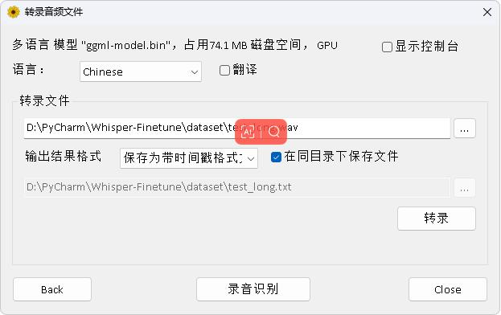
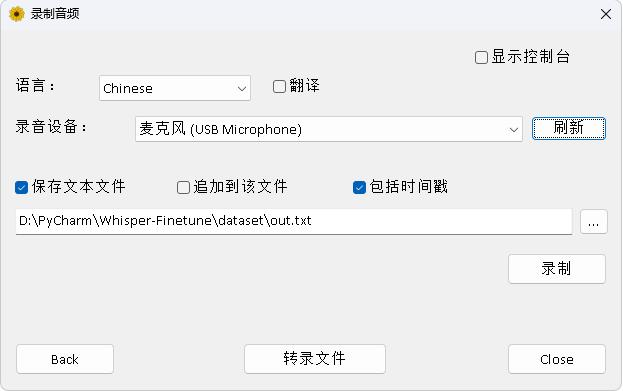

# Windows Desktop

[简体中文](./README.md) | English

**Disclaimer, this document was obtained through machine translation, please check the original document [here](./README.md).**


The program was translated using [Whisper](https://github.com/Const-me/Whisper), and the source code can be found in the previous project. The model format is GGML, which is the same as the Android deployment, so you'll need to convert the model format before you can use it.

## Convert model

1. To convert your models, run `convert-ggml.py` from the root of your `Whisper-Finetune` project to convert your models to ggml format for your Android project. The models you need to convert can be original Transformers. It can also be a fine-tuned model.
```shell
python convert-ggml.py --model_dir=models/whisper-tiny-finetune/ --whisper_dir=whisper/ --output_path=models/whisper-tiny-finetune-ggml.bin
```


## Effect picture

效果图如下：
<br/>
<div align="center">
<br/>
图1：加载模型页面
<br/>
<br/>
图2：选择音频文件转录
<br/>
<br/>
图3：录音转录
</div>
